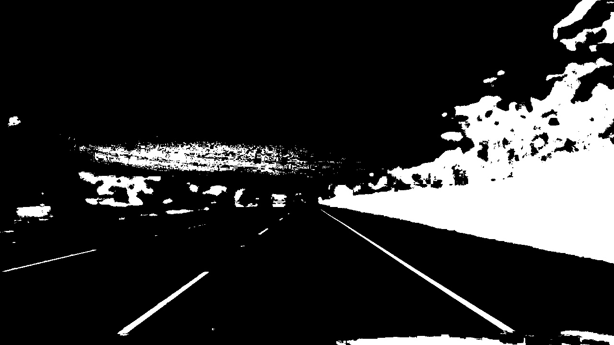
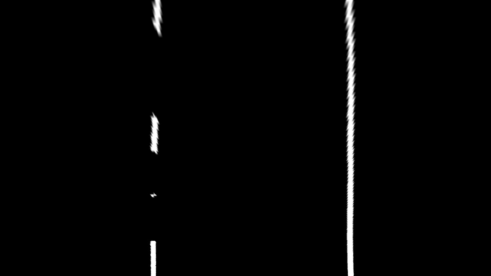
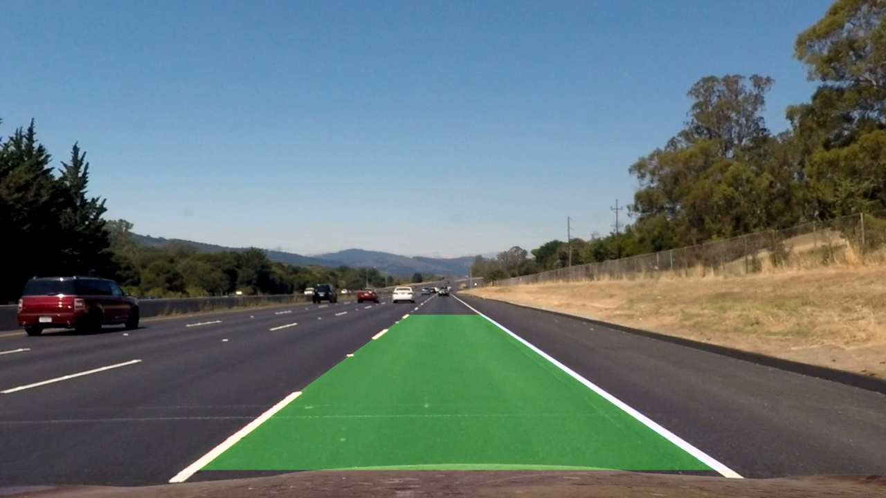

# Advanced-Lane-Lines
Second project of the Term 1 of Udacity's Self Driving Car Nanodegree program.

  

**Google Drive:** https://drive.google.com/drive/folders/11MoWuMYjVapMuLJ8zvYwzrDFcMlZ5TUk?usp=sharing

Please download the following files from the above mentioned google drive link:

- **camera_cal:** Contains the calibration images for the camera

- **challenge_test_images:** Contains the test images for the project

- **output_images:** Contains the full set of output images of the project

- **output_videos:** Contains the full set of output videos of the project

- **test_images:** Contains the test images for the project

- **test_videos:** Contains the test videos for the project  

   

**Repository:** https://github.com/YashBansod/udacity-self-driving-car/Advanced-Lane-Lines/

The goals / steps of this project are the following:

1) Compute the camera calibration matrix and distortion coefficients given a set of chessboard images.
2) Apply a distortion correction to raw images.
3) Use color transforms, gradients, etc., to create a thresholded binary image.
4) Apply a perspective transform to rectify binary image ("birds-eye view").
5) Detect lane pixels and fit to find the lane boundary.
6) Determine the curvature of the lane and vehicle position with respect to center.
7) Warp the detected lane boundaries back onto the original image.
8) Output visual display of the lane boundaries and numerical estimation of lane curvature and vehicle position.

## 1) Compute the camera calibration matrix and distortion coefficients given a set of chessboard images.

We use the chessboard images given in the repository to calibrate the camera.
At this point the camera matrix and the distortion parameters are calculated.

## 2) Apply a distortion correction to raw images.

Using the camera matrix and the distortion parameters calculated in the above step (Step 1) we can undistort any image
taken by **that camera**.

The following is the output after distortion correction:

<table class="alt">
    <tr>
      <th>
        

             

              Distorted Image
        

      </th>
      <th>
        

             

              Corrected Image
        

      </th>
    <tr>
</table>

More results are saved in **output_images/distortion_correction**

## 3) Use color transforms, gradients, etc., to create a thresholded binary image.
In my case I relied only on thresholding the Grayscale Intensity for white lines and "B" Channel from LAB colorspace for yellow line. This works satisfactorily for the default project video and the challenge video. I will try to upgrade this pipeline at a later time when I try to solve the harder challenge videos.  

The following is the output after distortion correction and thresholding to create the binary image:

<table class="alt">
    <tr>
      <th>
        

             

              Original Image
        

      </th>
      <th>
        

             

              Binary Thresholded Image
        

      </th>
    <tr>
</table>

More results are saved in **output_images/binary_img_pipe**

## 4) Apply a perspective transform to rectify binary image ("birds-eye view").
We use perspective transformation to obtain the birds-eye view of the binary thresholded image.

The following is the output after perspective transformation of the binary thresholded image:

<table class="alt">
    <tr>
      <th>
        

             

              Binary Thresholded Image
        

      </th>
      <th>
        

             

              Perspective Transform Image
        

      </th>
    <tr>
</table>

More results are saved in **output_images/perspective_transform**

## 5) Detect lane pixels and fit to find the lane boundary.
A sliding window approach is taken to recognise the pixels in the Bird's Eye View (BEV) image that belong 
to the lane boundaries and a 2nd order polynomial is used to fit lane boundary line.

The following is the output after we fit the lane boudary to the BEV image:

<table class="alt">
    <tr>
      <th>
        

             

              Perspective Transform Image
        

      </th>
      <th>
        

             

              Lane Boundary Fit
        

      </th>
    <tr>
</table>

More results are saved in **output_images/lane_boundary_fit**

## 6) Determine the curvature of the lane and vehicle position with respect to center. 
Here we measure the curvature of the lane by calculating the mean between the curvature of the lane boundaries.
Also, we assume that the camera image center is centre of the car. Then we calculate vehicle position laterally
w.r.t the center of the lane.

## 7) Warp the detected lane boundaries back onto the original image.
Here we use the reverse perspective to transform the BEV Lane Boundary Fit image back to its original perspective.
Then we do a weighted sum to overlay it on the original image.

The following is the output after we overlay the lane boundaries onto the original image:

<table class="alt">
    <tr>
      <th>
        

             

              Test Image
        

      </th>
      <th>
        

             

              Lane Boundary Overlay
        

      </th>
    <tr>
</table>

More results are saved in **output_images/lane_boundary_overlay**

## 8) Output visual display of the lane boundaries and numerical estimation of lane curvature and vehicle position.
This is the final step of the pipeline. Everything computed so far is presented to the user as the output.

The following is the output of the overall lane detection pipeline:

<table class="alt">
    <tr>
      <th>
        

             

              Test Image
        

      </th>
      <th>
        

             

              Lane Boundary Overlay
        

      </th>
    <tr>
</table>

More results are saved in **output_images/final_LD**

Video output of Lane Detection over **input_videos/project_video.mp4** is available at
**output_videos/project_video.mp4**

## Improvements:
- More sophisticated thresholding pipeline needs to be implemented to handle the challenge videos.
- Although there are various blocks in the pipeline that operate on the same input, no effort was made in writing a 
multi-processed / multi-threaded scheduling of the pipeline.
- Tracking the lane might help alleviating the problem of false detections.
- Perspective transformation can be sped up by using cv2.remap and using a Look up Table (LUT).

## Run Instructions
- Open the Terminal
- Clone this repository onto your local system.
- Enable a python interpreter in your environment (python version >=3.5) (It is recommended to use a python virtual interpreter).
- Install the requirements of this project from the [requirements.txt](./requirements.txt) by typing `pip install -r requirements.txt`.
- Change your present working directory to the inside of the cloned repository.
- Enable the jupyter notebook environment by typing `jupyter notebook` or `jupyter-notebook`.
- Open the [P2.ipynb](./P2.ipynb) file in Jupyter Notebook and run it like any other jupyter notebook.

## Project Development Done Using
Ubuntu 16.04  
PyCharm 2018.2  
Python 3.6  
