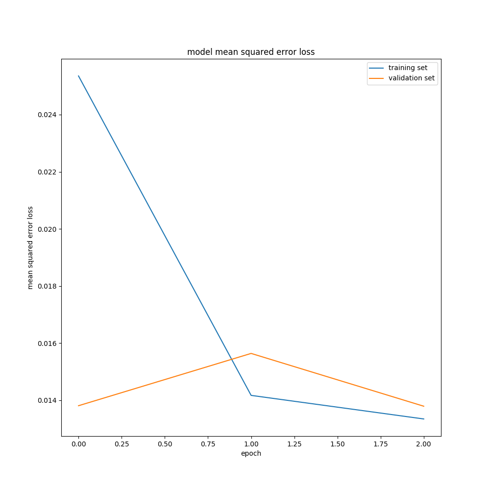

# **Deep Learning based Behavioral Cloning** 

**One Drive:** https://learnermanipal-my.sharepoint.com/:f:/g/personal/yash_bansod_learner_manipal_edu/ErBqGBWbZWRLkaG9nKFfMaQBRXKAWPwOVbttdOpsLBdQhg?e=utebzb

Please download the following files from the above mentioned one drive link:

- **final_run.mp4:** Video showing the final run results of this project

- **model.h5:** Keras saved model  

- **SimRec_1.7z:** Udacity Term 1 Simulator Driving Dataset 1

- **SimRec_2.7z:** Udacity Term 1 Simulator Driving Dataset 2

   

**Repository:** https://github.com/YashBansod/udacity-self-driving-car/Behavioral-Cloning/

- [**_Overview_**](#overview)  
- [**_Data Set Summary and Exploration_**](#data-set-summary-and-exploration)  
- [**_The NN Arcitecture_**](#the-nn-architecture)  
- [**_Present Limitations and Possible Improvements_**](#present-limitations-and-possible-improvements)  
- [**_Run Instructions_**](#run-instructions)  
- [**_Project Development Done Using_**](#project-development-done-using)  

## Overview
This Github repository was created for sharing the application implemented for the Fourth project of the Term 1 of 
[Udacity's Self Driving Car Nanodegree program](https://in.udacity.com/course/self-driving-car-engineer-nanodegree--nd013)

The original project repository containing the template code used in this project is 
[CarND-Behavioral-Cloning-P3](https://github.com/udacity/CarND-Behavioral-Cloning-P3)

Datasets used in the project were : 
- **SimRec_1.7z**
- **SimRec_2.7z**

Udacity provided sample driving dataset, however I did not use it : [Udacity Sample Driving Dataset](https://d17h27t6h515a5.cloudfront.net/topher/2016/December/584f6edd_data/data.zip)  

**Sample results:**  
A video demonstrating the final run of the car on the track is available in this GitHub Project: **final_run.mp4**  

**Trained model:**  
You can access the trained keras model used for autonomous control of the car from: **model.h5**

The model was able to drive the vehicle in the Udacity simulator at **30 mph** (max possible speed in the simulator), while keeping the car at the lane centre.  

The model was trained for 3 epochs:  

  

**Note:** I am hosting the following:  
- **SimRec_1.7z**
- **SimRec_2.7z**
- **model.h5**

on my cloud storage. It is configured to allow anyone with the link to download it. However, if you are unable to download the datasets from the above link, the access duration might have expired. Please feel free to contact me and I will update the access.  

## Data Set Summary and Exploration
### Dataset Summary
- Number of training examples = 71287  
- Number of validation examples = 7921  
- Image data shape = (160, 320, 3)  
- Label shape = (1,) _steering value_

### Dataset Visualizations
Feature Samples:  

<table class="alt">
    <tr>
      <th>
        

             

              Center Camera Image
        

      </th>
      <th>
        

             

              Left Camera Image
        

      </th>
      <th>
        

             

              Right Camera Image
        

      </th>
    </tr>
    <tr>
      <th>
        

             

              Center Camera Image
        

      </th>
      <th>
        

             

              Left Camera Image
        

      </th>
      <th>
        

             

              Right Camera Image
        

      </th>
    </tr>
</table>

### Dataset Collection Strategy
I recorded a total of 12 laps of driving data on the Map 1 of Udacity Simulator. 6 laps were recorded while driving anti-clockwise on the circuit and 6 laps were recorded while driving clockwise.  

All the recordings and their corresponding annotations (as .csv file) were stored seperately (One .csv file per recording).  

My initail plan was to use an LSTM at the end of the CNN Layers to encode sequential behavior in driving. However, due to limitation of the `drive.py` provided by Udacity, the closed loop implementation of a NN with LSTM would have been a bit difficult. Therefore, I forsaked that idea and worked with a standard CNN and Dense NN based Behavioral Cloning Architecture.  

## The NN Architecture

I implemented a NN with 5 CNN Layers (with Leaky Relu Activations), MaxPooling after 2nd and 4th CNN Layers, and 3 Fully Connected Layers (Final one being the logits layer).  

The following table demonstrates the complete Neural Network Architecture:

Layer (type)                    | Output Shape          |    Param #  |  
| ----------------------------- | --------------------- | ----------- |
| lambda_1 (Lambda)             | (None, 160, 320, 3)   |       0     | 
| cropping2d_1 (Cropping2D)     |           0           |             | 
| conv2d_1 (Conv2D)             | (None, 63, 318, 16)   |      448    | 
| leaky_re_lu_1 (LeakyReLU)     | (None, 63, 318, 16)   |       0     | 
| conv2d_2 (Conv2D)             | (None, 61, 316, 24)   |      3480   | 
| leaky_re_lu_2 (LeakyReLU)     | (None, 61, 316, 24)   |       0     | 
| max_pooling2d_1 (MaxPooling2  | (None, 30, 158, 24)   |       0     | 
| conv2d_3 (Conv2D)             | (None, 28, 156, 48)   |     10416   | 
| leaky_re_lu_3 (LeakyReLU)     | (None, 28, 156, 48)   |       0     | 
| conv2d_4 (Conv2D)             | (None, 26, 154, 64)   |     27712   | 
| leaky_re_lu_4 (LeakyReLU)     | (None, 26, 154, 64)   |       0     | 
| max_pooling2d_2 (MaxPooling2  | (None, 13, 77, 64)    |       0     | 
| conv2d_5 (Conv2D)             | (None, 11, 75, 128)   |     73856   | 
| leaky_re_lu_5 (LeakyReLU)     | (None, 11, 75, 128)   |       0     | 
| flatten_1 (Flatten)           | (None, 105600)        |       0     | 
| dense_1 (Dense)               | (None, 128)           |   13516928  | 
| leaky_re_lu_6 (LeakyReLU)     | (None, 128)           |       0     | 
| dense_2 (Dense)               | (None, 64)            |     8256    | 
| leaky_re_lu_7 (LeakyReLU)     | (None, 64)            |       0     | 
| dropout_1 (Dropout)           | (None, 64)            |       0     | 
| dense_3 (Dense)               | (None, 1)             |     65      | 

Total params: 13,641,161  
Trainable params: 13,641,161  
Non-trainable params: 0  

## Present Limitations and Possible Improvements
- The number of parameters in the model could be reduced. Experiments to optimize model size and performance were not performed due to limited time.
- The input data could be augmented further to generalize the model better.

## Run Instructions
- Open the Terminal
- Clone this repository onto your local system.
- Enable a python interpreter in your environment (python version >=3.5) (It is recommended to use a python virtual interpreter).
- Install the requirements of this project from the [requirements.txt](./requirements.txt) by typing `pip install -r requirements.txt`.
- Change your present working directory to the inside of the cloned repository.
- Download the **model.h5** into the directory.  
- Run the Udacity Term 1 Simulator on your system. [Udacity's Self-Driving Car Simulator](https://github.com/udacity/self-driving-car-sim)  
- Run the following command in your terminal (with the python virtual interpreter sourced): `python drive.py model.h5`.  
- Enter the autonomous mode in the Udacity's Self-Driving Car Simulator.

## Project Development Done Using
Ubuntu 16.04  
PyCharm 2018.2  
Python 3.5  
