# udacity-self-driving-car
This Github repository was created for sharing the application implemented for the projects of 
[Udacity's Self Driving Car Nanodegree program](https://in.udacity.com/course/self-driving-car-engineer-nanodegree--nd013)

## Project Contents

### [Camera-Calibration](./Camera-Calibration)

The IPython notebook in this repository contains code to calculate the camera matrix and distortion coefficients

<table class="alt">
    <tr>
      <th>
        

             

              GOPR0035
        

      </th>
      <th>
        

             
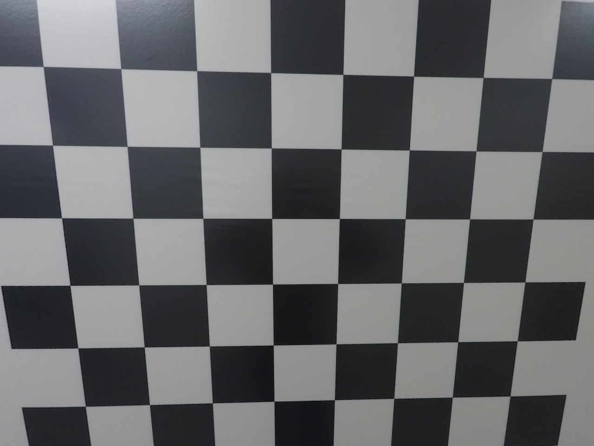

              undist_GOPR0035
        

    <tr>
</table>

### [Lane-Lines](./Lane-Lines)

**Finding Lane Lines on the Road** 

<table class="alt">
    <tr>
      <th>
        

             
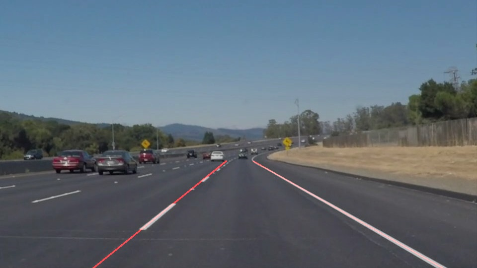

              solidWhiteCurve
        

      </th>
      <th>
        

             
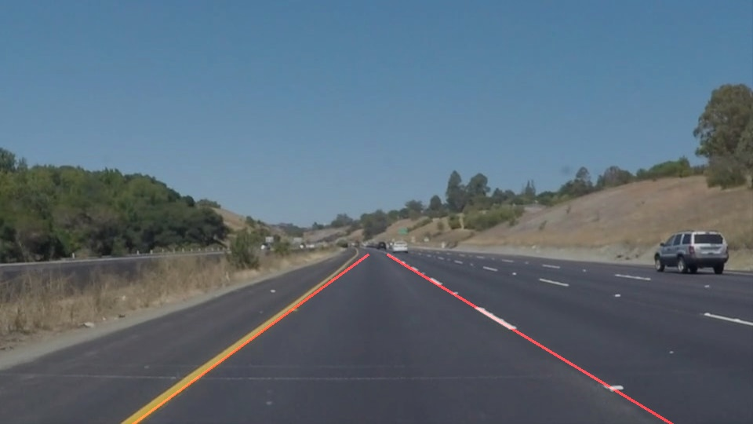

              solidYellowCurve
        

      </th>
      <th>
        

             
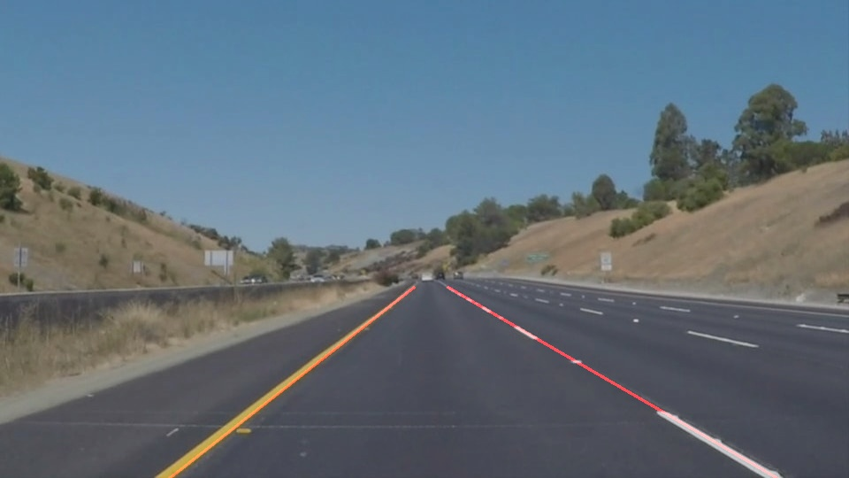

              whiteCarLaneSwitch
        

      </th>
    <tr>
</table>

### [Advanced-Lane-Lines](./Advanced-Lane-Lines)

**Finding Lane Lines on the Road (Advanced Algorithm)**

<table class="alt">
    <tr>
      <th>
        

             

              Test Image
        

      </th>
      <th>
        

             
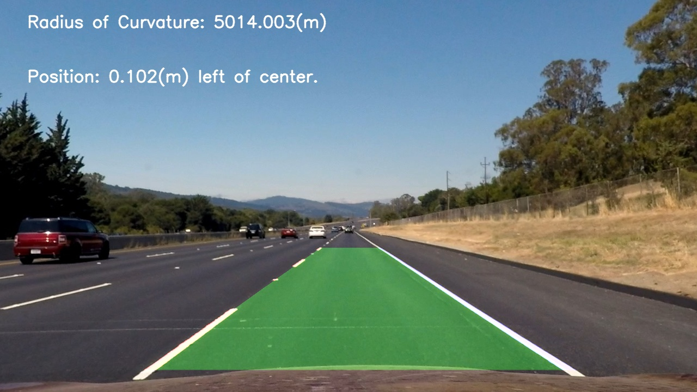

              Lane Boundary Overlay
        

      </th>
    <tr>
</table>

### [Traffic-Sign-Classifier](./Traffic-Sign-Classifier)

**Deep Learning based Traffic Sign Classification** 

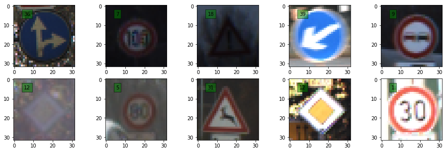
 

### [Behavioral-Cloning](./Behavioral-Cloning)

**Deep Learning based Behavior Cloning**

<table class="alt">
    <tr>
      <th>
        

             
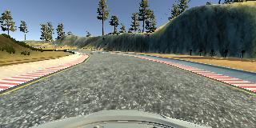

              Center Camera Image
        

      </th>
      <th>
        

             
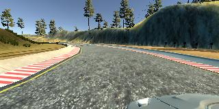

              Left Camera Image
        

      </th>
      <th>
        

             
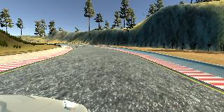

              Right Camera Image
        

      </th>
    </tr>
    <tr>
      <th>
        

             
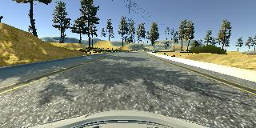

              Center Camera Image
        

      </th>
      <th>
        

             
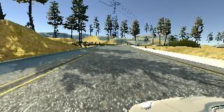

              Left Camera Image
        

      </th>
      <th>
        

             

              Right Camera Image
        

      </th>
    </tr>
</table>

### [Extended-Kalman-Filter](./Extended-Kalman-Filter)

In this project you will utilize a Kalman filter to estimate the state of a moving object of interest with noisy lidar
and radar measurements.