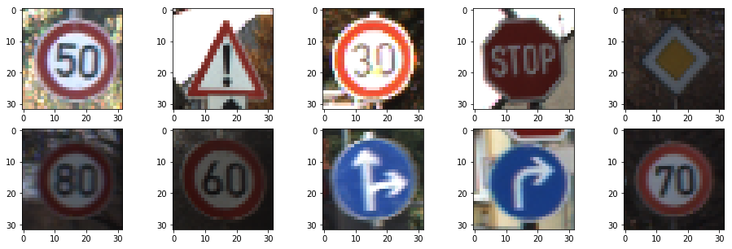
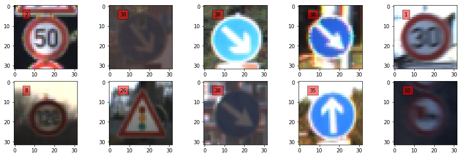
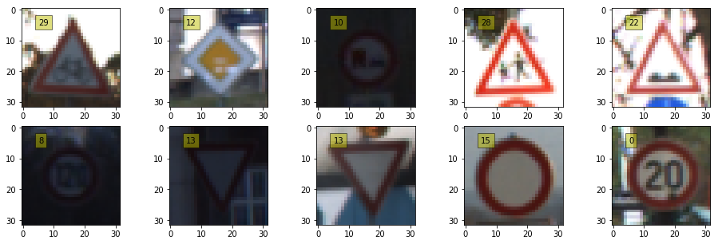
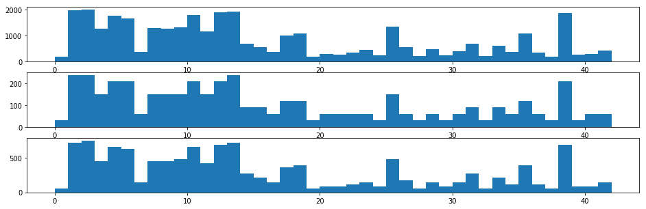
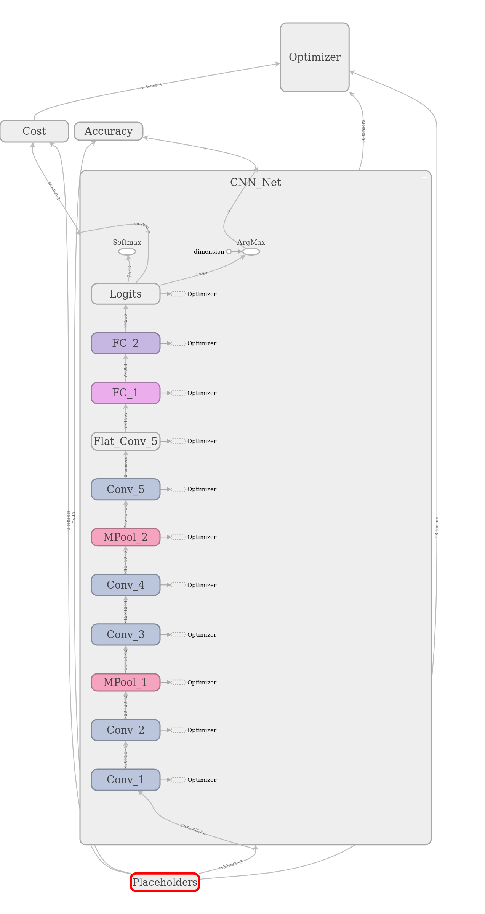

# **Deep Learning based Traffic Sign Classification** 

**Google Drive:** https://drive.google.com/drive/folders/18D6nh-OPgNg8im3KmJAukMAjiPZ_ncAv?usp=sharing

Please download the following files from the above mentioned google drive link:

- **saved_models:** Saved model of the neural network

   

**Repository:** https://github.com/YashBansod/udacity-self-driving-car/Traffic-Sign-Classifier/

- [**_Overview_**](#overview)  
- [**_Data Set Summary and Exploration_**](#data-set-summary-and-exploration)  
- [**_The NN Arcitecture_**](#the-nn-architecture)  
- [**_Present Limitations and Possible Improvements_**](#present-limitations-and-possible-improvements)  
- [**_Run Instructions_**](#run-instructions)  
- [**_Project Development Done Using_**](#project-development-done-using)  

## Overview
This Github repository was created for sharing the application implemented for the Third project of the Term 1 of 
[Udacity's Self Driving Car Nanodegree program](https://in.udacity.com/course/self-driving-car-engineer-nanodegree--nd013)

The original project repository containing the template code used in this project is 
[CarND-Traffic-Sign-Classifier-Project](https://github.com/udacity/CarND-Traffic-Sign-Classifier-Project)

Dataset used in the project was : [German Traffic Sign Recognition Database (GTSRB)](http://benchmark.ini.rub.de/?section=gtsrb&subsection=dataset)  
Udacity provided the reshaped GTSRB data pickled for the project : [Pickled GTSRB Data](https://s3-us-west-1.amazonaws.com/udacity-selfdrivingcar/traffic-signs-data.zip)  

**Sample results:**  
  

| Ground Truth  | 2  | 18 | 1  | 14 | 12 | 5  | 3  | 36 | 33 | 4  |
| ------------- | -- | -- | -- | -- | -- | -- | -- | -- | -- | -- |
| NN Prediction | 2  | 18 | 1  | 14 | 12 | 5  | 3  | 36 | 33 | 4  |

## Data Set Summary and Exploration
**Dataset Summary:**  
- Number of training examples = 34799  
- Number of testing examples = 12630  
- Image data shape = (32, 32, 3)  
- Number of classes = 43  

**Training Data Samples:**  

  

**Validation Data Samples:**  

  

**Test Data Samples:**  

  

**Dataset Distribution:**  

  

## The NN Architecture

I implemented a NN with 5 CNN Layers (with Leaky Relu Activations), MaxPooling after 2nd and 4th CNN Layers, and 3 Fully Connected Layers (Final one being the logits layer).  
The following tensorboard graph demonstrates the complete Neural Network Architecture.  
  
For full details on the NN architecture used, you can see the tensorboard graph directly:
- [tensorboard](./tensorboard/)  
run the following command it terminal: `tensorboard --logdir="./"` while being in the tensorboard directory in the project.
  
## Present Limitations and Possible Improvements
- Due to limited time I could invest in the project, I did not implement the dropout layer. Adding a dropout before the logits layer would help in regularization and it may help me in optimizing test performance.
- The number of parameters in the model could be reduced. Experiments to optimize model size and performance were not performed due to limited time.
- The input data could be augmented to generalize the model better.

## Run Instructions
- Open the Terminal
- Clone this repository onto your local system.
- Enable a python interpreter in your environment (python version >=3.5) (It is recommended to use a python virtual interpreter).
- Install the requirements of this project from the [requirements.txt](./requirements.txt) by typing `pip install -r requirements.txt`.
- Change your present working directory to the inside of the cloned repository.
- Enable the jupyter notebook environment by typing `jupyter notebook` or `jupyter-notebook`.
- Open the [Traffic_Sign_Classifier.ipynb](./Traffic_Sign_Classifier.ipynb) file in Jupyter Notebook and run it like any other jupyter notebook.

## Project Development Done Using
Ubuntu 16.04  
PyCharm 2018.2  
Python 3.5  
